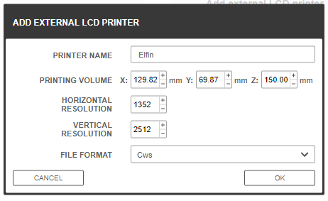

# Z-Suite compatibility for Nova3D Elfin
## What is this thing ?
It's a simple vanilla python script all it does is tweak a bit the CWS file exported by Z-Suite to have the 'slice.conf' needed by the Elfin printer. 
It pulls all the info it needs for the original file you don't need anything else as long as you configure Z-Suite correctly
## Z-suite settings
You need to configure the Elfin as follows in Z-Suite

The horizontal/vertical resolution matches the slices NovaMaker produces and the size [was computed](calibration/cal.md) using a calibration file to match the pixels counts (in X and Y) of NovaMaker for a know size object.
Even with those two decimal your X axis might be a bit off I advise editing the CustomPrinters.xml file to enter a more precise X dimension of 129.819121mm
## Usage
`python cv_main.py --file my_print.cws`

### Disclaimer
I'm not responsible for your action (I would advise not drinking the resin though) or your printer I only tested this on mine the original Elfin use at your own risk.

## A note on the format
[All I could reverse](format.md) from example output files I didn't go through any binaries