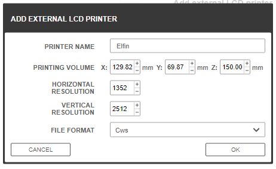
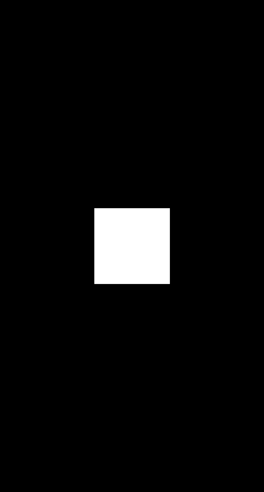
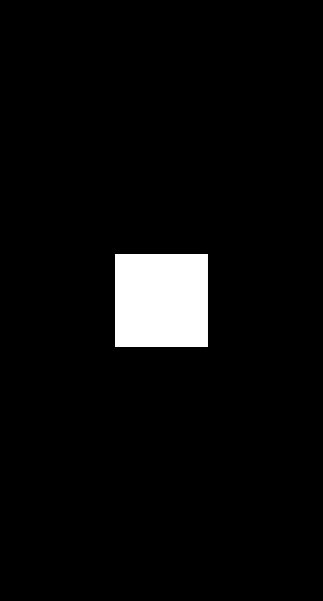

#Calibration info
Using a 20mm calibration cube file and counting the pixels the px/mm ratio was found to be exactly 19.35.
From the OEM Slicer NovaMaker v2.4.20 the screen resolution was found to be 2512 pixels by 1352 pixels.

This dictates the settings you must enter into Z-Suite

### Layer 0 generated with NovaMaker

### Layer 0 Generated with Z-Suite

